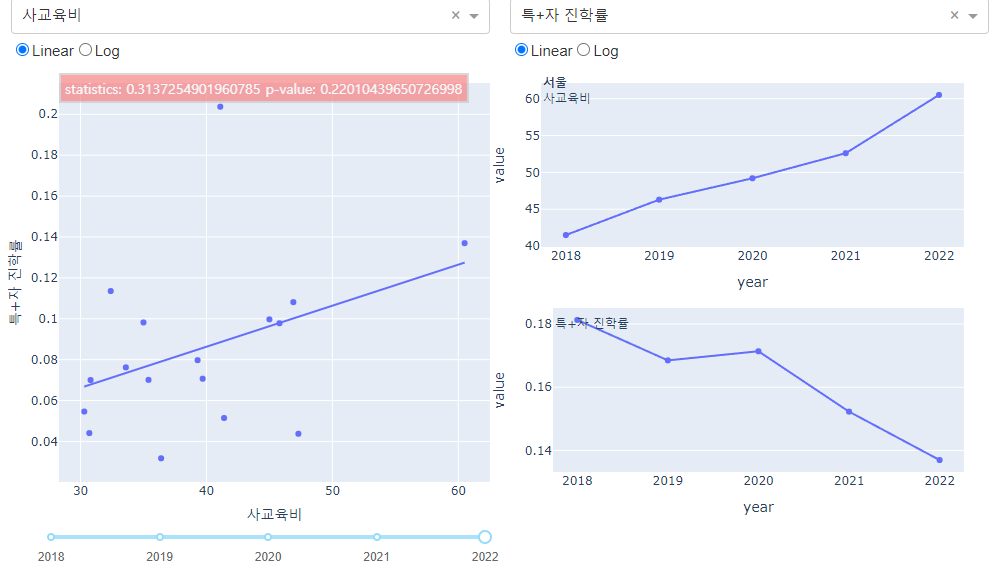
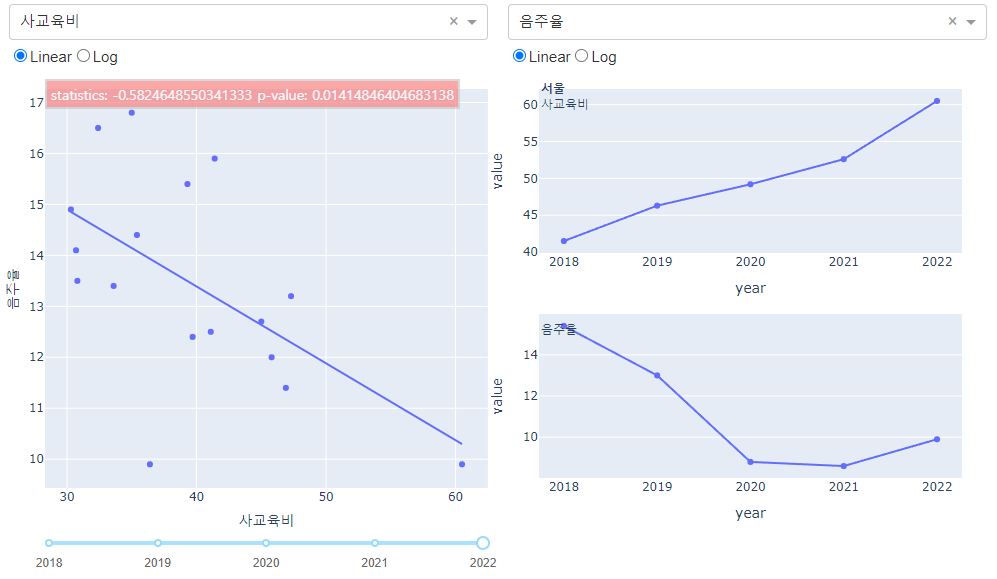

<h1 align="center"> 
   
  교육통계 프로젝트 분석 보고서
</h1>

<h3 align="center">
  : 사교육비 증가와 고교 유형별 진학률 및 청소년 비행·비만율·우울감의 상관관계
</h3>  
 

  프로젝트 기반 빅데이터 서비스 개발자 양성 과정 4기
   박준식⠂이찬녕⠂이형석⠂임유하

    

 

## Abstract
이 연구에서는 2018 년부터 2022 년도까지 지역별 중학생 졸업 후 상황 데이터를 분석하고, 각 지역의 사교육비 지출이 청소년 비행 및 학업성취도에 미치는 영향을 실증하고자 한다.
연도별 고교 진학률 및 청소년 비행률과 사교육비 지출을 통계 내 스피어만 상관계수를 통해 두 변수 사이의 상관관계를 분석하였다. 분석 결과 진학률과 사교육비 지출의 p-value 는 0.05 이상으로 상관관계가 없다는 결과를 보였고, 비행률과 사교육비 지출의 p-value 는 0.05 미만으로 상관관계가 통계적으로 유의한 결과를 나타내었다.  
<b>주제어 : 사교육비 지출, 고등학교 진학, 청소년 비행, spearman 상관분석</b>

 

## Introduction
기존 연구들에서는 지방보다 도시지역의 사교육비 지출이 더 크다는 결과를 보인다. (김현진, 2004) 즉, 서울지역에 거주하는 가구일수록 사교육비 지출이 더 많은 것을 의미한다. (우천식, 2004). 
또한, 특목고 진학계획이 있는 집단은 그렇지 않은 집단보다 도시지역 학생일 확률이 높다. (서은경, 2018)  

지역 규모가 클수록 사교육비는 유의하게 증가하는 경향이 있고(김현진, 2004; 김현진, 박균달, 2008), 특목고에 진학하려는 학생은 일반고에 진학하려는 학생보다 사교육을 더 많이 받거나 비싼 사교육을 받는다(박현정, 이준호, 2009). 그렇다면, 사교육비 지출이 고교진학률에 큰 영향을 준다는 결과를 나타내지 않을까.  

고교 진학 관련 뉴스에 따르면 가구소득, 사교육비 지출이 높을수록 특목고, 자사고 진학률이 높다고 한다(신현성, 2021). 이와 관련한 지역별 사교육비 지출에 따른 진학률 
차이는 청소년들이 사회경제적 차이를 느낄 수 있다. 많은 선행연구에서 부모의 사회경제적 지위는 청소년 자녀의 불안, 우울과 같은 정신건강 문제 등의 내재화 문제와 청소년 비행, 
알코올중독, 공격적인 행동 등의 외현화 문제에 영향을 미친다는 연구 결과를 제시하였다(Vollebergh et al, 2006; Wight et al, 2006).  

불균등한 사교육비 지출은 청소년의 주관적인 사회경제적 지위에 대한 인지에 영향을 미쳐 청소년들의 자존감이 낮아지는 결과를 초래할 수 있고, 이는 신체적 및 정신적인 문제로 이어질 수 있다. (Brunner, 1997; Chen & Paterson, 2006).
따라서 지역별 교육 기회의 불평등성 및 청소년 비행 문제 해소를 위해 지역별 중학생 졸업 후 상황 데이터, 사교육비 지출 데이터와 청소년 비행 데이터를 분석하고, 각 변수 사이의 상관관계를 실증하고자 한다.

 

## Method
 데이터 간의 상관관계를 분석하기에 앞서서 데이터들이 정규성을 만족하는지 검정하기 
위해 shapiro-wilk test 를 진행했다. 검정은 데이터가 정규성을 만족한다는 귀무가설과 
데이터가 정규성을 만족하지 못한다는 대립가설로 유의수준 0.05 에서 진행한다.
정규성 검정 결과가 귀무가설을 채택한다면 pearson 상관분석을 진행하며, 귀무가설을 
기각하고 대립가설을 채택한다면 spearman 상관분석을 통해 상관관계를 분석한다.
상관분석은 유의수준 0.05 하에 두 변수 간의 상관관계가 있다는 귀무가설과, 두 변수 간의 
상관관계가 없다는 대립가설로 분석을 진행한다.
분석 진행 후 사교육비와 다른 변수들의 상관관계의 시각화로 산점도와 선그래프로 
작성한다.
사교육비와 고교 진학 비율 및 청소년 비행 데이터, 우울감 등의 변수들을 분석하고 
그래프를 작성한다.

|  |
|:--:|
| <b> [Figure1] Project Workflow </b> |
모든 구성원은 전 과정에 종합적으로 기여했으나, 주도적으로 맡은 역할을 각자의 프레임에 넣어 나타냈다

 

## Result

최종 대쉬보드는 (https://first-dashboard.onrender.com)에서 확인할 수 있다.
총 9 개의 데이터 중에서 5 개의 데이터의 정규성 검정 결과 p-value 가 유의수준인 0.05
보다 작기 때문에 귀무가설을 기각하고 대립가설을 채택해서 데이터가 정규성을 만족하지 
못한다고 주장할 수 있다. 따라서 pearson 상관분석이 아니라 spearman 상관분석으로 
상관관계를 분석했다.

 
<b>i) 사교육비와 고교 진학률과의 상관관계</b>

|  |
|:--:|
| <b> [Figure2] 2022 년 서울의 사교육비와 특목고, 자율고 진학비율의 스피어만 상관계수 분석 그래프 </b> |

사교육비와 진학률의 상관관계는 2018 년부터 2022 년까지의 17 개 지역 모두 p-value 가 0.
05 이상인 결과를 보인다. 따라서 귀무가설을 기각할 수 없어 통계적으로 유의하다고 할 수 
없다.

 
<b>ii) 사교육비와 청소년 비행률과의 상관관계</b>

|   |
|:--:|
| <b> [Figure3] 2022 년 서울의 사교육비와 흡연율의 스피어만 상관계수 분석 그래프 </b> |

사교육비와 청소년 비행률의 상관관계는 2018 년부터 2022 년까지의 도합 10 개 년도 중 7
개 년도가 p-value 가 0.05 이하의 값을 가져 통계적으로 유의하다는 결과를 나타냈다.

 
<b>iii) 사교육비와 청소년 비만율과의 상관관계</b>

|  |
|:--:|
| <b> [Figure4] 2022 년 서울의 사교육비와 비만율의 스피어만 상관계수 분석 그래프 </b> |

사교육비와 비만율의 상관관계는 2020 년을 제외하면 모두 p-value 가 0.05 이하의 값을 
가져 통계적으로 유의하다는 결과를 나타냈다.

 

## Discussion

<b>i)</b> 
 사교육비와 특목고 진학률에는 유의미한 상관관계가 없었다. 고등학교 진학을 타 
지역으로 가는 경우는 대학 진학에 비해 흔하지 않은 만큼 사교육비나 학생들의 
성취도보다는 지역 내의 특목고 개수가 더 많은 영향을 끼치는 것으로 보인다. 실제로 
지역의 특목고 진학 비율 중 도내 진학 비율이 도외 진학비율 보다 더 많이 차지한다.   

<b>ii)</b>
 [Figure 3]를 보면 사교육비와 흡연율, 음주율 등의 청소년 비행이 유의미한 상관관계를 
나타냈다. 음주율의 경우 2019~2022 년, 흡연율의 경우 2018, 2020, 2022 년이 p-value 0.
05 이하의 음의 상관관계를 나타냈다. 또한 [Figure 4]의 사교육비와 비만율도 2020 년을 
제외하면 모두 p-value 0.05 이하로 유의미한 음의 상관관계를 나타냈다. 일반적인 
상식으로는 사교육비의 증가를 학습량의 증가 및 운동량의 하락으로 연결 지을 수 있다고 
생각했지만, 결과는 반대로 나타났다. 위의 두 결과를 통해 높은 사교육비를 부모의 관심 및 
좋은 생활 환경과 연관 지어 생각해 볼 수 있을 것이다.  

<b>iii)</b>
 사교육을 청소년의 우울감이나 자살위험과 연결 짓는 경우가 많아 사교육비와 우울감 
경험률의 연관관계를 살펴보았으나 5 개년 모두 연관관계가 없었다. 사교육은 수많은 우울 
유발 요인 중의 하나일 뿐인 데다 ii)의 논의와 마찬가지로 사교육비가 높다는 것은 자녀에 
대한 관심이나 부모의 높은 수입, 좋은 생활 환경을 기대할 수 있기 때문으로 보인다. 다만
"사교육비 지출이 청소년 자녀의 우울과 신체증상에 미치는 영향."(이성림, 김진숙, 2022)의
연구에서는 음의 상관관계가 보고되었는데, 이는 수집한 데이터의 차이로 인한 결과로 
보인다.  

<b>iv)</b>
 사교육비가 올라갈수록 청소년 비행과 비만 등의 부정적인 수치가 내려간다는 결과를 
통해 사교육을 긍정적인 가치와 연결 지을 수 있다는 의의가 있다. 교육을 제공하는 회사의 
입장에서 사교육이 연일 ‘불평등’이나 ‘카르텔’, ‘학대’ 등의 부정적인 단어와 엮이는 것이 
불편할 수 있다. 그러나 이번 분석을 통해 사교육을 부모의 관심이나 사랑, 노력 등의 긍정적
가치와 연결 짓는다면 대중을 설득하고 나아가 매출을 증대하는 데 도움이 될 수 있다.  

<b>v)</b>
 개인이나 각 가정의 데이터가 아닌 시 도별로 ⋅ 뭉뚱그려진 데이터를 사용했기 때문에 
표본의 수가 적고 변수를 통제할 수 없다는 한계가 있다. 예를 들어 고교별 진학률같은 경우 
각 도시 내에서 개인별로 사교육비 지출과 특목고 진학률의 상관관계를 알아봤다면 도시 내 
특목고의 입학 정원이라는 변수를 통제할 수 있고 가설 1 이 채택됐을 가능성도 있을 것이다.

 
 

-----

 
 

### Library Version
dash Python package (version 2.9.3)
 Flask Python package (version 2.2.2)
 pandas Python package (version 1.5.3)
 plotly Python package (version 5.9.0)
 scipy Python package (version 1.10.0)
 statsmodels Python package (version 0.14.0)
 gunicorn Python package (version 21.2.0)

 

### Reference 
박현정, 이준호 "중학생의 특수목적고등학교 진학계획이사교육 참여 및 사교육비 지출에 미치는 영향 분석" 아시아교육연구 10.3 pp.213-238 (2009) : 213.
 이덕난, 유지연 "초·중·고교 사교육비 변화 추이 분석 및 향후 과제" NARS 현안분석 247 호, 국회입법조사처, 2022.4.28.
 박선영, 마강래 "지역의 교육환경이 사교육비 지출에 미치는 영향에 관한 연구" 지역연구 31.3 pp.3-17 (2015) : 3.
 서은경, 김현철, 황수진, 이철원 "특목고 진학계획의 사교육비 지출에 대한 인과효과 분석"교육학연구 56.2 pp.161-190 (2018) : 161.
 하준경 "특목고가 가계의 사교육비 지출에 미치는 영향" 경제분석 16.3 pp.159-194 (2010): 159.
 박소영, 민병철 "특수목적고 진학 결정요인 분석" 한국교육 36.4 pp.29-48 (2009) : 29.이성림, 김진숙. "사교육비 지출이 청소년 자녀의 우울과 신체증상에 미치는 영향." Human Ecology Research(HER) 60.2 (2022): 289-302.
 신현성, “가구소득,사교육비 높을수록 특목고,자사고 진학률↑” 서울뉴스통신, 2021.10.7 snakorea.com/news/articleView.

